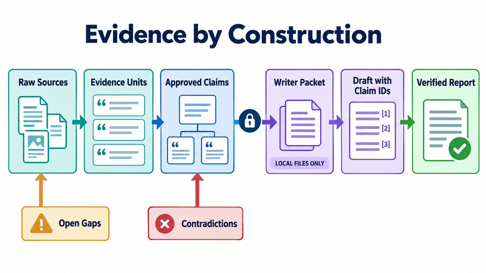

# Deep Research Protocol Skill 设计方案

## 1. 目标

这个项目不是新的搜索引擎，也不是点击后自动生成长报告的产品。它是一套由 Agent 执行、由文件保存状态、由确定性脚本执行硬校验的 Deep Research Protocol。

它解决的问题是：如何把开放研究任务转化为可拆解、可并行、可恢复、可审计，并且可以明确说明证据边界的研究工程。

系统质量的基本单位不是“写得流畅的段落”，而是：

> 一个有明确范围、得到证据支持、保留必要限定语并且可以追溯到原始来源的 Claim。

## 2. 项目文档与 Skill 的边界

仓库根目录是开源项目的说明层：

```text
deep-research-protocol/
├── README.md
├── DESIGN.md
├── LICENSE
└── skills/
    └── deep-research-protocol/
```

`README.md` 负责项目介绍、安装和快速使用；`DESIGN.md` 负责解释架构、设计判断和实现边界。二者不是 Skill 执行时必须加载的指令。

`skills/deep-research-protocol/` 是可以被单独复制、安装和分发的完整 Skill，其中包含 `SKILL.md`、运行时 references、脚本和测试。Skill 不能通过相对路径依赖仓库根目录的说明文档，否则被单独安装后会失效。

项目目录和 GitHub 仓库使用小写短横线 `deep-research-protocol`。这是 URL、包目录和 Skill 机器名的常见形式，也符合 Skill 命名规则。对用户展示的标题使用 `Deep Research Protocol`。

## 3. 用户入口

### `new`

从新的研究问题开始：明确 Research Contract、拆解任务、独立研究、汇总证据、识别 Gap、定向补研、写作和验证。

### `audit`

基于用户提供的完整研究报告，拆解审计维度并由独立 subagent 检查引用、证据、数字、逻辑、覆盖范围和偏差。

`audit` 默认不重写文章。修订是另外一次需要用户授权的任务。

中断后的继续执行属于原模式内部的运行状态，不增加 `resume`。已有报告也不作为 `extend` 入口；要么审计它，要么将其视为新研究中的线索材料。

## 4. 四个角色

### Lead Agent

Lead 负责建立 Research Contract、检查环境能力、拆分 Workstream、唤起 subagent、合并和审核交付、管理 Claim/Evidence/Gap/Contradiction、生成 Writer Packet、调度 Writer 与 Verifier，以及最终交付。

Lead 不承担实质性的领域研究。若 Researcher 失败，Lead 不能在自己的上下文里静默补做，而应修复任务、重新派发或报告阻塞。

### Researcher

每个 Researcher 只负责一个 Workstream：使用真实可用的搜索能力，保存搜索记录和原始语料，提取原子 Evidence，生成与 Evidence 绑定的 Candidate Claim，保存反方证据、矛盾和未知项，最后生成结构化 Handoff。

Researcher 不写最终文章，也不能修改其他 Workstream 或全局 Registry。

### Writer

Writer 是断网的证据约束型写作者。它只读取本地 Writer Packet；必要时可以读取已保存的 Raw Capture；禁止搜索、浏览、访问外部 URL 或用模型记忆增加事实。需要补研时生成自由格式的 `article/writer_requests.md`，不能合理猜测。

第一版只使用一个 Writer，以保持全文术语、结构和声音一致。只有真实使用证明单个 Writer 成为长报告瓶颈后，才增加章节 Writer。

### Verifier

Verifier 使用本地研究空间独立检查 Claim Marker、数字、日期、引语、限定语、矛盾、章节口径和关键遗漏。Verifier 只报告问题，不静默改写文章。

## 5. 架构


图中的 Lead Agent 只负责规划、调度与整合；Research Subagents 独立研究并通过文件交付；Gap Analysis 未通过时重新进入研究，只有完整证据链才能进入无网络访问权限的 Writer。Writer 可以发回 Research Request，Verifier 也可以发回 Evidence Issue，但二者都只能请求 Lead 决策，不能自行搜索或调度。

```text
User request
    ↓
Lead Agent
    ├── Research Contract
    ├── Capability Preflight
    └── Workstream Decomposition
              ↓
    ┌─────────┼─────────┐
    ▼         ▼         ▼
Researcher  Researcher  Researcher
   T001        T002        T003
    │           │           │
    ├── raw/    ├── raw/    ├── raw/
    ├── evidence.jsonl      │
    ├── candidate_claims    │
    └── handoff.md          │
    └───────────┴───────────┘
                ↓
        Lead integration
                ↓
      Claim–Evidence Registry
                ↓
       Coverage / Gap Analysis
          │              │
       incomplete      complete
          │              │
    new workstream     Writer Packet
                         ↓
                    Writer Agent
                         ↓
                    Verifier Agent
                         ↓
                 Validator + Renderer
                         ↓
                    Final Report
```

## 6. 独立 Workstream

每个 Researcher 使用独立上下文，可以减少主题之间的上下文污染，也能让研究方向并行执行，并强制每个任务产生可检查的交付物。

Workstream 不等于一个 Query。它应当能形成相对独立的研究结论，例如市场规模、竞争格局、技术机制、客户需求、监管风险或反方证据。

推荐每轮 3–8 个 Workstream。受宿主并发限制时分批执行，而不是把任务重新合并到一个 Agent。

协议只提供三个默认预算：整个研究最多创建 20 个 Research Workstream；正式写作前的 Gap Analysis 最多触发 3 轮回补研究；进入写作后，Writer 或 Verifier 最多共同触发 2 轮 Synthesis Return Research。首轮、Gap 回补、Synthesis 回退、Verifier 请求和替代任务都计入同一个 20 个 Workstream 总额度。并发数由宿主环境决定，不属于协议预算。

## 7. 并发写入安全

所有 subagent 共享项目文件系统，因此必须避免并发修改同一个 JSONL 文件：

> Subagent 只写自己的目录；Lead Agent 是唯一可以写全局 Registry 的角色。

每个 Workstream 都有独立的 `sources.jsonl`、`evidence.jsonl` 和 `candidate_claims.jsonl`。一轮结束后，由 Lead 统一分配全局 ID、归一化 URL、合并重复来源并写入 `registry/`。

## 8. 搜索能力策略

研究开始前，Lead 必须检查当前环境实际拥有的能力，而不能根据产品名称猜测。

优先顺序：

1. Search/Fetch MCP、专业研究连接器、原生 Web Search 或相关搜索 Skill；
2. Browser Automation / Browser Use；
3. Computer Use 操作可访问的本机浏览器。

`new` 至少要求能够发现来源并读取来源正文。如果只拿到搜索摘要、无法打开来源，则不能把摘要当成 Critical Claim 的证据。

如果完全没有可用的搜索或网页读取能力，Agent 必须停止，明确告诉用户当前环境无法完成 Deep Research。错误信息必须使用用户的语言，而不是写死中文或英文。

如果没有 subagent 能力，也必须停止，不能降级成单 Agent 全链路执行。

## 9. 原始语料与 Evidence

每个实际使用的来源都保存 Raw Capture。它表示工具真正返回的内容，包括来源 URL、获取时间、读取方式和是否截断。

Evidence 是从 Raw Capture 中提取的最小事实单元，保留 Source ID、位置、原文摘录、事实提取、支持/反对/背景关系，以及局限和限定语。

模型总结不能伪装成原文；被截断的页面不能由模型补全；搜索摘要只能作为 Lead。

## 10. Claim–Evidence Graph

Evidence 表示来源实际说了什么；Claim 表示研究最终允许主张什么。

Claim 分为 Observation、Inference、Estimate、Forecast、Opinion 和 Unknown，避免把分析师估算、公司指引和已发生事实混在一起。

Critical Claim 的最低结构门槛是：一个直接相关的一手来源，或者两个真正独立的高质量来源组。这不自动证明 Evidence 在逻辑上支持 Claim；Verifier 仍然检查 Entailment。

## 11. Gap 驱动研究

第一轮结束后，Lead 不发布“继续深入研究”这样的宽泛指令，而是创建新的定向 Workstream。Gap 包含缺少什么、为什么不足、严重程度、下一步查询和完成条件。

一次 Gap Research Round 可以包含多个 Workstream，从 Lead 派发开始，到这些任务全部整合并重新计算 Coverage 时结束。默认最多进行 3 轮。研究停止要求 Critical Gap 为零，或预算确实耗尽且最终报告明确披露不足。预算耗尽不能被记录为研究完成。

## 12. Writer Packet

Writer Packet 是研究与写作之间的能力隔离层。只有经过 Lead 审核、满足证据门槛的 Claim 才能进入。

它包含写作目标、受众、语言和格式，章节结构，每章允许使用的 Claim，Claim 到 Evidence/Source 的映射，必须呈现的矛盾，以及必须披露的限制。

Writer 不直接决定来源是否可信，也不在写作阶段新增事实，但它可以自主判断材料不足或冲突时应当请求补研、保留不确定性、呈现双方、删去不重要判断，还是将问题作为限制披露。协议不为这个判断规定固定决策树。

需要补研时，Writer 使用自由格式的 `article/writer_requests.md` 说明问题和有价值的研究方向。这个文件没有字段或 JSON Schema。Lead 负责判断是否值得研究、合并相关请求、创建新的 Workstream、整合新证据并重建 Writer Packet。Writer 和 Verifier 触发的补研共同使用最多 2 轮 Synthesis Return Research；每轮无论创建几个 Workstream，都同时受总计 20 个 Workstream 的约束。

只要 `writer_requests.md` 仍有非空内容，报告就不能发布。Lead 处理后将决定记录到 `decisions.md`，由 Writer 确认已解决或明确转化为公开限制后再清空请求。

## 13. Citation by construction



草稿中的事实命题使用 `[[C017]]` Claim Marker，而不是让 Writer 自己拼 URL。

```text
C017 -> E031, E044 -> S008, S013 -> Markdown footnotes
```

引用在 Evidence 提取阶段就与 Claim 绑定，而不是文章写完后再补。`render_report.py` 只做确定性转换，不调用模型。

## 14. Audit 模式

Audit 将报告拆成 Claim/Citation 覆盖、引用支持关系、数字日期单位、内部逻辑和跨章节一致性，以及范围遗漏和偏差等独立轨道。每个实际创建的 Track 由独立 subagent 执行，Lead 只负责合并重复 Findings。

如果用户提供完整来源包，可以离线审计。如果只有外部 URL 且环境不能访问，不能把内部一致性检查称为完整 Evidence Audit。

## 15. 确定性脚本

`validate_run.py` 检查 JSONL、ID、引用关系、Critical Claim 的结构化证据门槛、Claim Marker、Open Critical Gap、三个研究预算，以及是否仍存在未处理的 `writer_requests.md`。

`render_report.py` 把 Claim Marker 转换成 Claim–Evidence–Source 映射得到的 Markdown Footnote。未知 Claim、Evidence 或 Source 会直接失败。

两个脚本只使用 Python 标准库，避免增加安装成本。

## 16. 第一版不做什么

第一版不实现搜索 API 封装、通用爬虫、LangGraph、向量数据库、Web UI、自动模型路由、多层 Agent 层级或独立持久化服务。

这些能力由 Codex、Claude Code、Gemini、MCP 或其他宿主提供。只有真实运行证明文件协议不够用时，才把失败频繁的节点升级成工程化硬约束。

## 17. 验证策略

Skill 使用官方 Validator 检查 Frontmatter 和目录结构。脚本使用最小 `unittest` 覆盖合法链路的验证与渲染，以及未知 Claim Marker 的失败行为。

首次真实验证应选择一个中等规模题目，观察 Lead 是否真实委派、Researcher 是否保存 Raw Capture、Writer 是否完全不搜索、证据不足是否返回 Gap，以及 Verifier 是否能正确路由问题。

根据真实失败点做窄幅修正，不为假设中的未来场景增加更多抽象。
