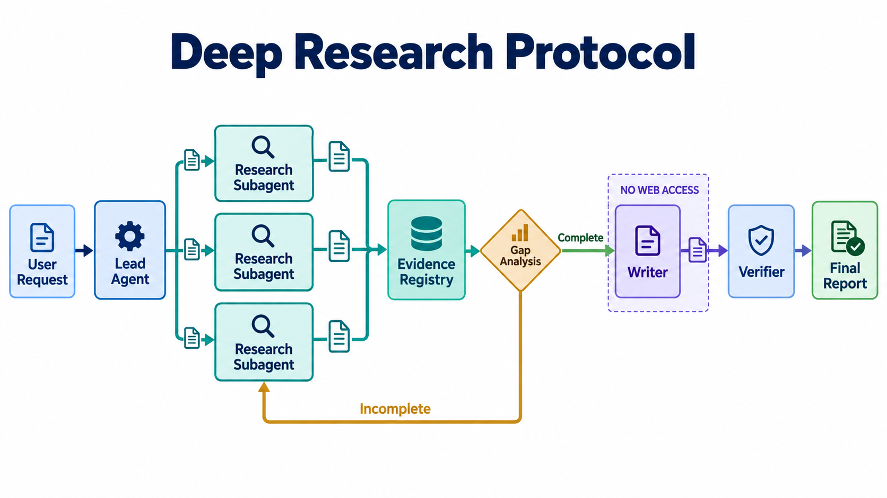

# Deep Research Protocol

An auditable, file-backed Agent Skill for multi-agent deep research and completed-report audits.



The protocol separates four responsibilities:

- Lead Agent plans and integrates.
- Research subagents gather and persist evidence independently.
- Writer produces prose only from an approved local research packet and cannot browse.
- Verifier audits the draft without silently rewriting it.

Every handoff is persisted in files, and deterministic scripts validate claim-evidence-source links before publication.

## Repository layout

```text
deep-research-protocol/
├── README.md
├── DESIGN.md
├── LICENSE
├── assets/
│   ├── architecture-overview.png
│   └── evidence-by-construction.png
└── skills/
    └── deep-research-protocol/
        ├── SKILL.md
        ├── agents/
        ├── references/
        ├── scripts/
        └── tests/
```

`README.md` and `DESIGN.md` document the open-source project. The directory under `skills/` is the self-contained Agent Skill and can be installed or copied independently.

## Modes

- `new`: research a new question through delegated workstreams.
- `audit`: audit a user-supplied completed report.

## Install

```bash
npx skills add NotWizard/deep-research-protocol --skill deep-research-protocol
```

Or copy/link `skills/deep-research-protocol/` into your agent's skill directory.

## Use

```text
$deep-research-protocol Conduct a new deep research project on ...
```

```text
$deep-research-protocol Audit the attached completed report.
```

The host must provide subagent delegation. New research also requires a working search and page-reading capability. The protocol prefers structured search tools and MCP servers, then browser automation, then computer use. If no usable capability exists, it reports that limitation in the user's language instead of answering from model memory.

See [DESIGN.md](DESIGN.md) for the architecture and artifact contracts.

## Validate a run

```bash
python3 skills/deep-research-protocol/scripts/validate_run.py /path/to/run --publish
python3 skills/deep-research-protocol/scripts/render_report.py /path/to/run
```

The scripts use only Python's standard library.

## License

MIT
